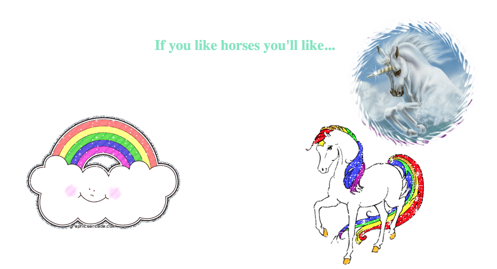

# Key Sequence Detection (Konami Code)

## Objective:
When someone inputs a certain sequence of keys in the input window something needs to happen. For this file we use [Cornify.com](cornify.com) to add unicorns into the DOM every time a user correctly enters the secret code.

``window.addEventListener('keyup', (e) => {
		console.log(e.key);
		pressed.push(e.key);
		pressed.splice(-secretCode.length - 1, pressed.length - secretCode.length);
		if(pressed.join('').includes(secretCode)){
			console.log('DING');
			cornify_add();
		}
		console.log(pressed);
	});``